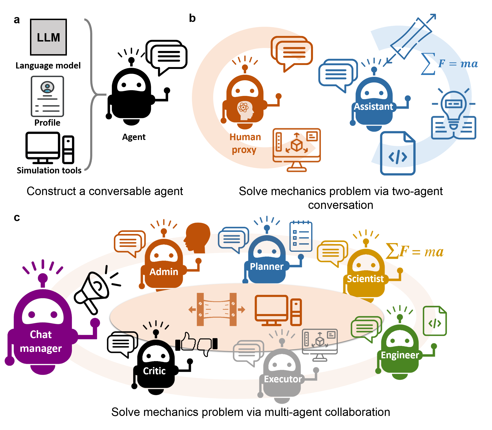

# MechAgents: Large language model multi-agent collaborations can solve mechanics problems, generate new data, and integrate knowledge  

B. Ni, M.J. Buehler*

Massachusetts Institute of Technology

*Contact: mbuehler@MIT.EDU

Paper: B. Ni, M.J. Buehler, Extreme Mechanics Letters, 2024, DOI: doi.org/10.1016/j.eml.2024.102131, in press. 

## Summary
Solving mechanics problems using numerical methods requires comprehensive intelligent capability of retrieving relevant knowledge and theory, constructing and executing codes, analyzing the results, a task that has thus far mainly been reserved for humans. While emerging AI methods can provide effective approaches to solve end-to-end problems, for instance via the use of deep surrogate models or various data analytics strategies, they often lack physical intuition since knowledge is baked into the parametric complement through training, offering less flexibility when it comes to incorporating mathematical or physical insights. By leveraging diverse capabilities of multiple dynamically interacting large language models (LLMs), we can overcome the limitations of conventional approaches and develop a new class of physics-inspired generative machine learning platform, here referred to as MechAgents. A set of AI agents can solve mechanics tasks, here demonstrated for elasticity problems, via autonomous collaborations. A two-agent team can effectively write, execute and self-correct code, in order to apply finite element methods to solve classical elasticity problems in various flavors (different boundary conditions, domain geometries, meshes, small/finite deformation and linear/hyper-elastic constitutive laws, and others). For more complex tasks, we construct a larger group of agents with enhanced division of labor among planning, formulating, coding, executing and criticizing the process and results. The agents mutually correct each other to improve the overall team-work performance in understanding, formulating and validating the solution. Our framework shows the potential of synergizing the intelligence of language models, the reliability of physics-based modeling, and the dynamic collaborations among diverse agents, opening novel avenues for automation of solving engineering problems.



Figure 1: Framework of multi-agent AI modeling for solving mechanics problems. 

## Sample results

A few sample results are shown below. Figure 2 depicts results generated by a two-agent team. Figure 3 shows an example of final scripts, codes and results generated by the two-agent team and the multi-agent group with division of labor for solving the uniaxial tension assignment and error correcton. 


Figure 2: Conversation as developed by the model, and result files generated by the two-agent team. a, Summary of a typical conversation flow observed in one round of conversation between the two agents, during which the assistant agent often can correct itself (dash arrows) based on the outcome provided by the proxy agent. b-d, Predicted displacement fields for Rounds 1-3 in Conversation 1. e-f, Predicted stress fields as identified in Rounds 4-5. Note that, when being asked to plot shear stress component, the assistant agent mistakenly extracted von Mises stress (e) in Round 4. After receiving suggestions from humans, it was able to correct the mistake and produced the correct result (f) in Round 5.


Figure 3: Final scripts, codes and results generated by the two-agent team and the multi-agent group with division of labor for solving the uniaxial tension assignment and error correcton. a, The FEniCS script by the two-agent team defines an incomplete geometry, formulates wrong weak form for linear elasticity problem and uses wrong formula to calculate traction force on the right edge (highlighted in the red dash rectangles). b, The code developed by the multi-agent group is correct after multiple rounds of revision via group chatting and mutual correction. c, The result file generate by the two-agent team (c), which is  wrong. d, The result file of displacement filed generated by the multi-agent group, which is correct.  

### Additional discussion and remarks

Our case studies on the multi-agent modeling frameworks have demonstrated great potentials in amplifying the capability of conservable agents via suitable organizations as well as integrating AI-agents into physics-based modeling for automation, thus preparing for a human-AI teaming future for solving various engineering and scientific problems. From one perspective, the self-correction capacity and mutual corrections observed in the two-agent and multi-agent teams strongly indicate that the interaction between agents plays key roles in affecting their overall performances as they achieve certain synergies that single AI agents could not achieve on their own. Future studies can focus on improving/optimizing the role design and chatting topology in the multi-agent team for solving specific engineering problems. 

On another front, the automation of mechanics modeling through multi-agent frameworks may enhance the efficiency of applying modeling tools for many other engineering or science applications, including a variety of other modeling techniques such as first-principles calculations, molecular modeling and multiscale integration. Notably, through this strategy, the AI model is not limited to training data but can generate new information, data and insights during inference. The results are seamlessly integrated into the solution. 

By achieving robust handling of variants of models, modeling strategies, including code errors, future studies can take advantage of this autonomoys conversable modeling framework to curate large datasets with rich domain knowledge, discover novel structure/material designs for superior mechanical properties as well as teaching mechanics theory and modeling methods in a human-AI interactive manner. This is especially promising when computational methods can be directly coupled with experimental platforms that offer high-throughput data retrieval.

### Codes for Colab
This repository contains easy-to-use Google Colab notebooks that organize various collaborative teams of LLM powered agents to solve elasticity problems using finite element modeling. They can easily be run in a local environment. 

#### List of notebooks:
> 1. [A two-agent team solves linear elasticity problems](./0_colab_notebook_for_TwoAgentTeam_Elasticity/0_TwoAgen_MultiStep_LElasticity.ipynb)
> 2. [A two-agent team solves hyperelasticity problems](./0_colab_notebook_for_TwoAgentTeam_Elasticity/1_TwoAgen_OneStep_LE_to_HE.ipynb)
> 3. [A multi-agent group solves linear elasticity problems](./1_colab_notebook_for_MulAgentGroup_LE/0_MultiGen_MultiStep_LE.ipynb)
> 4. [The multi-agent group Vs. the two-agent team in solving pratical elastcity problems](./2_colab_notebook_cmp_TwoA_vs_MulA_LE/0_MultiVsTwo_OneStep_LE.ipynb)

### Requirements
To run the colab notebooks, just click the "Open in Colab" badge and include your OpenAI API key to the language model in the relvent cells. Note that the algorithm may incure relatively large number of token charges. 

#### Key packages used in this work
> - fenics/dolfin-2019.2
> - pyautogen-0.1.14
> - openai-0.28.1

### Original paper and citation

Cite this work as:
```
@article{NiBuehler_EML_2024,
    title   = {MechAgents: Large language model multi-agent collaborations can solve mechanics
               problems, generate new data, and integrate knowledge},
    author  = {B. Ni, M.J. Buehler},
    journal = {Extreme Mechanics Letters},
    year    = {2024},
    volume  = {},
    DOI     = {doi.org/10.1016/j.eml.2024.102131},
    pages   = {},
    url     = {https://arxiv.org/abs/2311.08166}
}
```

